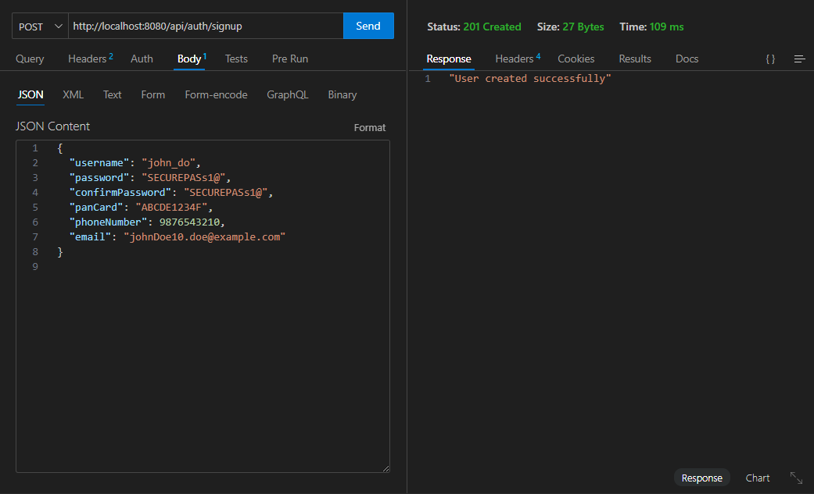
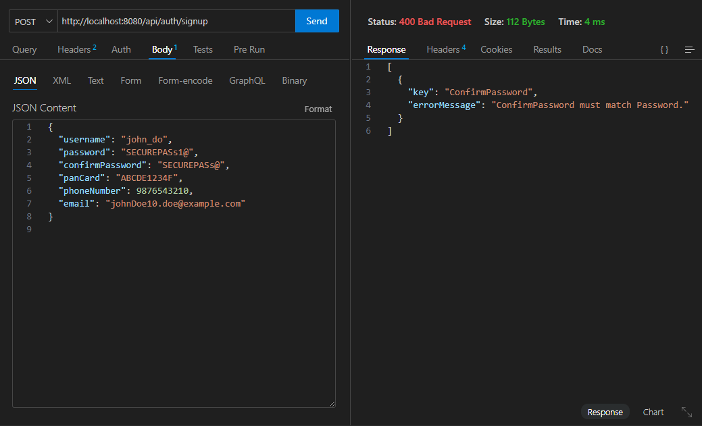
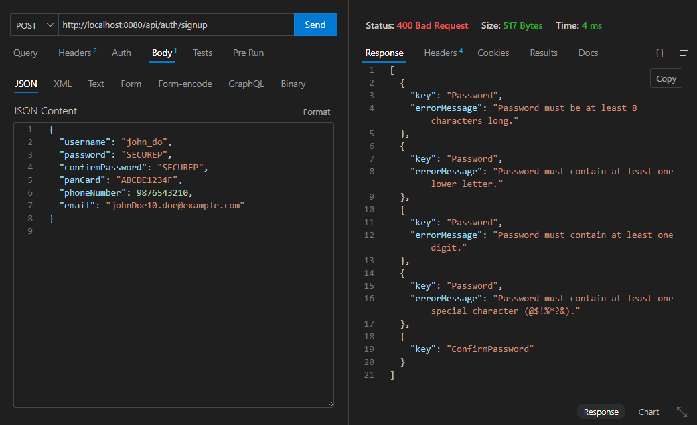
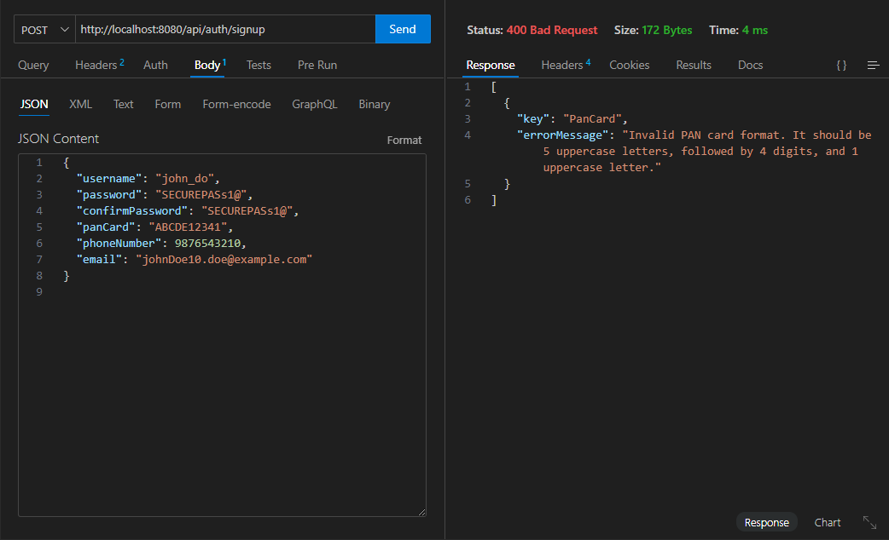
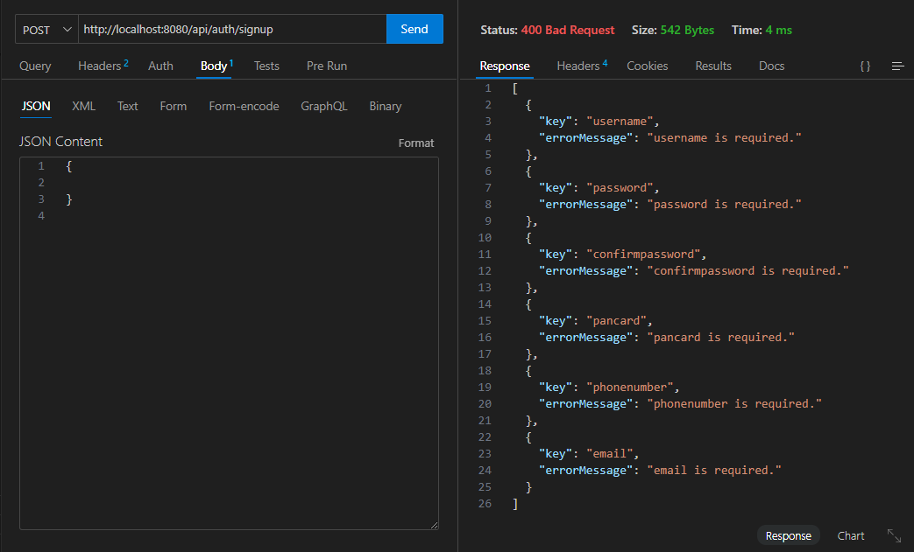
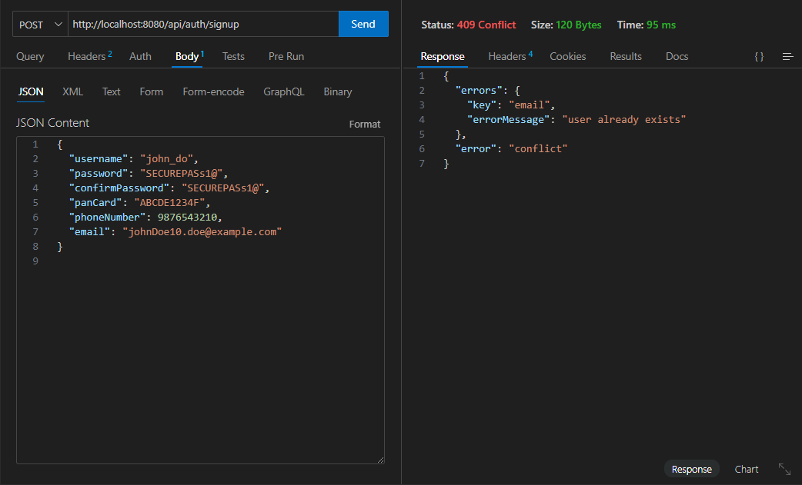

# stock_broker_appilcation
# User Creation API

This document provides an overview of the user creation functionality implemented in the `authentication` module and instructions on how to run the application.

## Features
- Handles user registration requests.
- Validates input data.
- Stores user details securely.
- Provides detailed error responses.
- Integrated Swagger documentation.

## Technologies Used
- **Go (Gin Framework)** for building RESTful APIs.
- **GORM** for database interactions.
- **Swagger** for API documentation.
- **PostgreSQL** as the database.

## API Endpoint
### Create User
**Endpoint:** `POST /api/auth/signup`

**Request Body:**
```json
{
  "username": "john_do",
  "password": "SECUREPASs1@",
  "confirmPassword": "SECUREPASs1@",
  "panCard": "ABCDE1234F",
  "phoneNumber": 9876543210,
  "email": "johnDoe10.doe@example.com"
}
```

**Responses:**
- `201 Created`: User created successfully.

- `400 Bad Request`: Bad Request.






- `409 Conflict`: User already exists.

- `500 Internal Server Error`: Server issue.

## Running the Application
### Prerequisites
- Install [Go](https://go.dev/doc/install)
- Install [PostgreSQL](https://www.postgresql.org/download/)
- Set up environment variables for database connection

### Steps to Run
1. Clone the repository:
   ```sh
   git clone https://github.com/your-repo.git
   cd stock_broker_application/src/app/authentication
   ```
2. Install dependencies:
   ```sh
   go mod tidy
   ```
3. Start the server:
   ```sh
   go run main.go
   ```
4. Access Swagger UI:
   Open [http://localhost:8080/swagger/index.html](http://localhost:8080/swagger/index.html) in your browser.

## Notes
- Ensure the database is running and the connection is configured correctly.
- Modify `docs.SwaggerInfo.Host` if running on a different port.

